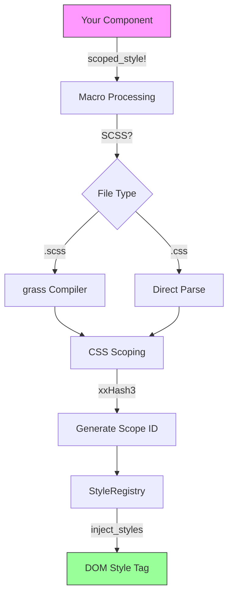

# Advanced Guide: dioxus_style 🎨

A comprehensive guide to advanced features, complete examples, and internal architecture of the `dioxus_style` crate.

---

## 📚 Table of Contents

1. [Architecture Overview](#architecture-overview)
2. [Complete Example: Todo App](#complete-example-todo-app)
3. [Advanced SCSS Patterns](#advanced-scss-patterns)
4. [Performance Optimizations](#performance-optimizations)
5. [Internal Architecture](#internal-architecture)
6. [Debugging Tips](#debugging-tips)
7. [Best Practices](#best-practices)

---

## 🏗️ Architecture Overview



### Key Components

| Component | File | Purpose |
|-----------|------|---------|
| `StyleRegistry` | `runtime_injector.rs` | Global store for all scoped styles |
| `ScopedStyle` | `runtime_injector.rs` | Wrapper holding scope ID |
| `scoped_style!` | `macros.rs` | Main macro for style scoping |
| `parse_and_scope` | `style_parser.rs` | CSS selector transformation |
| `compile_scss_to_css` | `scss_compiler.rs` | SCSS → CSS with caching |
| `generate_hash` | `hash.rs` | xxHash3 + base62 encoding |

---

## 🚀 Complete Example: Todo App

### Project Structure

```
todo_app/
├── Cargo.toml
├── src/
│   ├── main.rs
│   ├── components/
│   │   ├── mod.rs
│   │   ├── todo_item.rs
│   │   └── todo_list.rs
│   └── styles/
│       ├── todo_item.scss
│       ├── todo_list.scss
│       └── _variables.scss
```

### Cargo.toml

```toml
[package]
name = "todo_app"
version = "0.1.0"
edition = "2021"

[dependencies]
dioxus = "0.5"
dioxus_style = "0.3"
```

### styles/_variables.scss

```scss
// Shared variables across components
$primary-color: #3498db;
$danger-color: #e74c3c;
$success-color: #27ae60;
$text-color: #2c3e50;
$border-radius: 8px;

// Mixins
@mixin flex-center {
    display: flex;
    justify-content: center;
    align-items: center;
}

@mixin card-shadow {
    box-shadow: 0 4px 6px rgba(0, 0, 0, 0.1);
}
```

### styles/todo_item.scss

```scss
@import 'variables';

.todo-item {
    display: flex;
    align-items: center;
    padding: 1rem;
    border-bottom: 1px solid #eee;
    transition: background-color 0.2s ease;
    
    &:hover {
        background-color: #f8f9fa;
    }
    
    &.completed {
        opacity: 0.6;
        
        .todo-text {
            text-decoration: line-through;
            color: #999;
        }
    }
}

.todo-checkbox {
    @include flex-center;
    width: 24px;
    height: 24px;
    border: 2px solid $primary-color;
    border-radius: 50%;
    margin-right: 1rem;
    cursor: pointer;
    
    &.checked {
        background-color: $success-color;
        border-color: $success-color;
        
        &::after {
            content: '✓';
            color: white;
            font-size: 14px;
        }
    }
}

.todo-text {
    flex: 1;
    color: $text-color;
    font-size: 1rem;
}

.delete-btn {
    @include flex-center;
    width: 32px;
    height: 32px;
    background: none;
    border: none;
    color: $danger-color;
    cursor: pointer;
    opacity: 0;
    transition: opacity 0.2s;
    
    .todo-item:hover & {
        opacity: 1;
    }
    
    &:hover {
        background-color: rgba($danger-color, 0.1);
        border-radius: 50%;
    }
}
```

### styles/todo_list.scss

```scss
@import 'variables';

.todo-container {
    @include card-shadow;
    max-width: 500px;
    margin: 2rem auto;
    background: white;
    border-radius: $border-radius;
    overflow: hidden;
}

.todo-header {
    background: linear-gradient(135deg, $primary-color, darken($primary-color, 15%));
    color: white;
    padding: 1.5rem;
    
    h1 {
        margin: 0;
        font-size: 1.5rem;
        font-weight: 600;
    }
}

.todo-input-wrapper {
    display: flex;
    padding: 1rem;
    border-bottom: 1px solid #eee;
}

.todo-input {
    flex: 1;
    padding: 0.75rem 1rem;
    border: 2px solid #ddd;
    border-radius: $border-radius;
    font-size: 1rem;
    outline: none;
    transition: border-color 0.2s;
    
    &:focus {
        border-color: $primary-color;
    }
}

.add-btn {
    @include flex-center;
    margin-left: 0.5rem;
    padding: 0.75rem 1.5rem;
    background-color: $primary-color;
    color: white;
    border: none;
    border-radius: $border-radius;
    cursor: pointer;
    font-weight: 600;
    transition: background-color 0.2s;
    
    &:hover {
        background-color: darken($primary-color, 10%);
    }
    
    &:disabled {
        opacity: 0.5;
        cursor: not-allowed;
    }
}

.todo-list {
    list-style: none;
    margin: 0;
    padding: 0;
}

.empty-state {
    @include flex-center;
    flex-direction: column;
    padding: 3rem;
    color: #999;
    
    .icon {
        font-size: 3rem;
        margin-bottom: 1rem;
    }
}
```

### src/main.rs

```rust
use dioxus::prelude::*;
use dioxus_style::inject_styles;

mod components;
use components::{TodoList, TodoItem};

fn main() {
    dioxus::launch(App);
}

#[component]
fn App() -> Element {
    rsx! {
        // Inject all collected styles at the root
        style { dangerous_inner_html: "{inject_styles()}" }
        
        // Global reset styles (optional)
        style {
            "* {{ margin: 0; padding: 0; box-sizing: border-box; }}"
            "body {{ font-family: 'Segoe UI', Tahoma, sans-serif; background: #f5f5f5; }}"
        }
        
        TodoList {}
    }
}
```

### src/components/mod.rs

```rust
mod todo_item;
mod todo_list;

pub use todo_item::TodoItem;
pub use todo_list::TodoList;
```

### src/components/todo_list.rs

```rust
use dioxus::prelude::*;
use dioxus_style::with_scss;

use super::TodoItem;

#[derive(Clone, PartialEq)]
pub struct Todo {
    pub id: u32,
    pub text: String,
    pub completed: bool,
}

#[with_scss("src/styles/todo_list.scss")]
pub fn TodoList() -> Element {
    let mut todos = use_signal(|| vec![
        Todo { id: 1, text: "Learn Dioxus".to_string(), completed: true },
        Todo { id: 2, text: "Build awesome app".to_string(), completed: false },
    ]);
    let mut input = use_signal(|| String::new());
    let mut next_id = use_signal(|| 3u32);

    let add_todo = move |_| {
        let text = input().trim().to_string();
        if !text.is_empty() {
            todos.write().push(Todo {
                id: next_id(),
                text,
                completed: false,
            });
            next_id += 1;
            input.set(String::new());
        }
    };

    let toggle_todo = move |id: u32| {
        if let Some(todo) = todos.write().iter_mut().find(|t| t.id == id) {
            todo.completed = !todo.completed;
        }
    };

    let delete_todo = move |id: u32| {
        todos.write().retain(|t| t.id != id);
    };

    rsx! {
        div {
            "data-scope": "{css}",
            class: "{css}_todo-container",
            
            // Header
            div {
                "data-scope": "{css}",
                class: "{css}_todo-header",
                h1 { "data-scope": "{css}", "📝 My Todos" }
            }
            
            // Input area
            div {
                "data-scope": "{css}",
                class: "{css}_todo-input-wrapper",
                
                input {
                    "data-scope": "{css}",
                    class: "{css}_todo-input",
                    r#type: "text",
                    placeholder: "What needs to be done?",
                    value: "{input}",
                    oninput: move |e| input.set(e.value()),
                    onkeypress: move |e| {
                        if e.key() == Key::Enter {
                            add_todo(());
                        }
                    }
                }
                
                button {
                    "data-scope": "{css}",
                    class: "{css}_add-btn",
                    disabled: input().trim().is_empty(),
                    onclick: add_todo,
                    "Add"
                }
            }
            
            // Todo list
            if todos().is_empty() {
                div {
                    "data-scope": "{css}",
                    class: "{css}_empty-state",
                    span { class: "{css}_icon", "🎉" }
                    span { "All done! Add a new task above." }
                }
            } else {
                ul {
                    "data-scope": "{css}",
                    class: "{css}_todo-list",
                    
                    for todo in todos() {
                        TodoItem {
                            key: "{todo.id}",
                            todo: todo.clone(),
                            on_toggle: move |id| toggle_todo(id),
                            on_delete: move |id| delete_todo(id),
                        }
                    }
                }
            }
        }
    }
}
```

### src/components/todo_item.rs

```rust
use dioxus::prelude::*;
use dioxus_style::with_scss;

use super::todo_list::Todo;

#[with_scss("src/styles/todo_item.scss")]
pub fn TodoItem(
    todo: Todo,
    on_toggle: EventHandler<u32>,
    on_delete: EventHandler<u32>,
) -> Element {
    let completed_class = if todo.completed { "completed" } else { "" };
    let checkbox_class = if todo.completed { "checked" } else { "" };

    rsx! {
        li {
            "data-scope": "{css}",
            class: "{css}_todo-item {css}_{completed_class}",
            
            // Checkbox
            div {
                "data-scope": "{css}",
                class: "{css}_todo-checkbox {css}_{checkbox_class}",
                onclick: move |_| on_toggle.call(todo.id),
            }
            
            // Text
            span {
                "data-scope": "{css}",
                class: "{css}_todo-text",
                "{todo.text}"
            }
            
            // Delete button
            button {
                "data-scope": "{css}",
                class: "{css}_delete-btn",
                onclick: move |_| on_delete.call(todo.id),
                "🗑️"
            }
        }
    }
}
```

---

## ⚡ Advanced SCSS Patterns

### 1. Theming with CSS Variables

```scss
// theme.scss
:root {
    --primary: #3498db;
    --secondary: #2ecc71;
    --danger: #e74c3c;
    --bg-color: #ffffff;
    --text-color: #2c3e50;
}

[data-theme="dark"] {
    --bg-color: #1a1a2e;
    --text-color: #eaeaea;
}

.themed-button {
    background: var(--primary);
    color: var(--bg-color);
}
```

### 2. Responsive Mixins

```scss
// _breakpoints.scss
$breakpoints: (
    "sm": 576px,
    "md": 768px,
    "lg": 992px,
    "xl": 1200px
);

@mixin respond-to($breakpoint) {
    @if map-has-key($breakpoints, $breakpoint) {
        @media (min-width: map-get($breakpoints, $breakpoint)) {
            @content;
        }
    }
}

// Usage
.card {
    padding: 1rem;
    
    @include respond-to("md") {
        padding: 2rem;
    }
    
    @include respond-to("lg") {
        padding: 3rem;
    }
}
```

### 3. Animation Utilities

```scss
// _animations.scss
@mixin fade-in($duration: 0.3s) {
    animation: fadeIn $duration ease-in-out;
}

@keyframes fadeIn {
    from { opacity: 0; transform: translateY(-10px); }
    to { opacity: 1; transform: translateY(0); }
}

@mixin slide-in($direction: left, $distance: 20px) {
    $x: if($direction == left, -$distance, if($direction == right, $distance, 0));
    $y: if($direction == up, -$distance, if($direction == down, $distance, 0));
    
    animation: slideIn-#{$direction} 0.3s ease-out;
    
    @keyframes slideIn-#{$direction} {
        from { transform: translate($x, $y); opacity: 0; }
        to { transform: translate(0, 0); opacity: 1; }
    }
}

// Usage
.modal {
    @include fade-in(0.2s);
}

.notification {
    @include slide-in(right);
}
```

---

## 🔧 Performance Optimizations

### What's Optimized Internally

| Optimization | Description |
|--------------|-------------|
| **Zero Allocation** | Uses `&'static str` - no runtime String allocation |
| **SCSS Caching** | Compiled SCSS cached via `OnceLock<HashMap>` |
| **RwLock** | Concurrent reads for `inject_styles()` |
| **xxHash3** | Fast, collision-resistant hashing |
| **Compile-time CSS** | All scoping happens at compile time |
| **Minification** | Release builds auto-minify CSS |

### Best Practices for Performance

```rust
// ✅ Good: Single style injection at root
#[component]
fn App() -> Element {
    rsx! {
        style { dangerous_inner_html: "{inject_styles()}" }
        MyComponent {}
        OtherComponent {}
    }
}

// ❌ Avoid: Multiple inject_styles() calls
#[component]
fn BadExample() -> Element {
    rsx! {
        style { dangerous_inner_html: "{inject_styles()}" }  // Duplicate!
        div { "content" }
    }
}
```

---

## 🔍 Internal Architecture

### Style Scoping Flow

```
Input CSS:                    Output CSS:
─────────────────────────────────────────────────────
.button { }          →        .sc_a1b2c3_button { }
#header { }          →        #sc_a1b2c3_header { }
div { }              →        div[data-scope="sc_a1b2c3"] { }
.btn:hover { }       →        .sc_a1b2c3_btn:hover { }
```

### Selector Transformation Rules

| Input | Output | Rule |
|-------|--------|------|
| `.class` | `.{scope}_class` | Class prefixing |
| `#id` | `#{scope}_id` | ID prefixing |
| `element` | `element[data-scope="{scope}"]` | Data attribute |
| `:root` | `:root` | Global (unchanged) |
| `*` | `*` | Universal (unchanged) |
| `@keyframes` | `@keyframes` | Passed through |
| `@media` | Scopes inner content | Recursive scoping |

### Hash Generation

```rust
// Input: file path + content
// Hash: xxHash3 (64-bit) → base62 encoded

"button.scss::$color: red; .btn { color: $color; }"
    ↓ xxHash3
0x3A8F7B2C9D1E4F05
    ↓ base62
"sc_3xK9mP2n"  // 8-11 characters
```

---

## 🐛 Debugging Tips

### 1. View Generated CSS

```rust
// Print all registered styles
fn debug_styles() {
    let styles = inject_styles();
    println!("=== Generated CSS ===\n{}", styles);
}
```

### 2. Check Scope ID

```rust
let css = scoped_style!("button.scss");
println!("Scope ID: {}", css);  // Output: sc_a1b2c3d4
```

### 3. Inspect in Browser

```html
<!-- Check data-scope attribute -->
<div data-scope="sc_a1b2c3" class="sc_a1b2c3_container">
    Content
</div>

<!-- Check generated <style> tag -->
<style>
    .sc_a1b2c3_container { ... }
</style>
```

### 4. Common Issues

| Issue | Cause | Fix |
|-------|-------|-----|
| Styles not applying | Missing `data-scope` | Add `"data-scope": "{css}"` |
| Wrong class name | Old format | Use `{css}_classname` not `{css}.classname` |
| SCSS compile error | Undefined variable | Check `@import` paths |
| File not found | Wrong path | Use path relative to `Cargo.toml` |

---

## 📋 Best Practices

### 1. File Organization

```
src/
├── components/
│   ├── button/
│   │   ├── mod.rs
│   │   └── button.scss
│   ├── card/
│   │   ├── mod.rs
│   │   └── card.scss
└── styles/
    ├── _variables.scss    # Shared variables
    ├── _mixins.scss       # Shared mixins
    └── _reset.scss        # Global reset
```

### 2. Naming Conventions

```scss
// Use component-based naming
.todo-item { }           // ✅ Component name
.todo-item__checkbox { } // ✅ BEM-style child
.todo-item--completed { }// ✅ BEM-style modifier

// Avoid generic names
.container { }  // ❌ Too generic
.wrapper { }    // ❌ Too generic
```

### 3. Keep Styles Modular

```rust
// ✅ Good: One component, one style file
#[with_scss("button.scss")]
fn Button() -> Element { ... }

// ❌ Avoid: Massive shared style files
#[with_css("all-styles.css")]  // 5000 lines 😱
fn App() -> Element { ... }
```

### 4. Use SCSS Features

```scss
// ✅ Use variables for consistency
$primary: #3498db;

// ✅ Use nesting for clarity
.card {
    &:hover { }
    &__title { }
}

// ✅ Use mixins for reuse
@mixin button-base { }
```

---

## 📖 API Reference

### Macros

| Macro | Usage | Description |
|-------|-------|-------------|
| `scoped_style!` | `scoped_style!("file.scss")` | Load and scope CSS/SCSS |
| `css!` | `css!("color: red;")` | Inline utility styles |
| `#[with_css]` | `#[with_css("file.css")]` | Attribute macro |
| `#[with_scss]` | `#[with_scss("file.scss")]` | SCSS-specific alias |
| `component_with_css!` | See docs | Function-like macro |

### Functions

| Function | Returns | Description |
|----------|---------|-------------|
| `inject_styles()` | `String` | Get all CSS for injection |

### Types

| Type | Description |
|------|-------------|
| `ScopedStyle` | Holds scope ID, implements `Display` |
| `StyleRegistry` | Global style storage |

---

## 🎉 Summary

`dioxus_style` provides:

- ✅ **Automatic CSS scoping** - No style conflicts
- ✅ **SCSS support** - Variables, nesting, mixins
- ✅ **Zero runtime overhead** - Compile-time processing
- ✅ **Hot reload** - CSS changes tracked
- ✅ **Performance optimized** - Caching, fast hashing

Happy styling! 🎨
